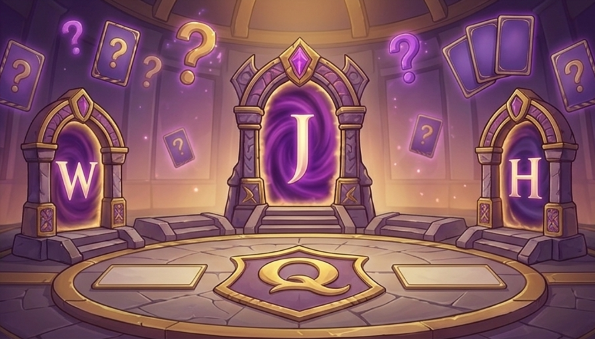
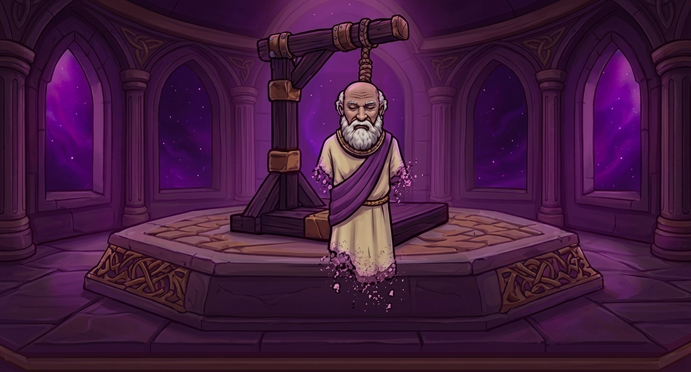
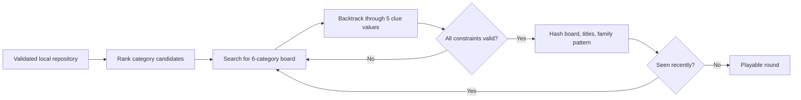
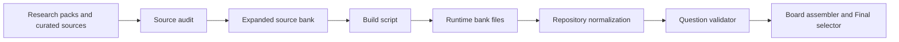
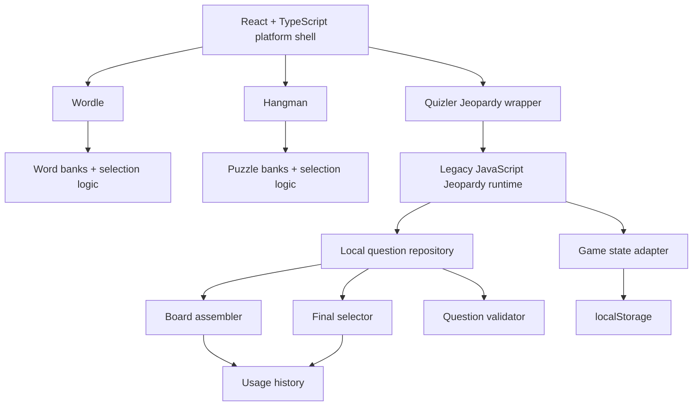
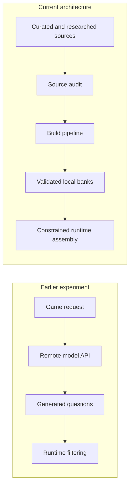

# Quizler Arena

<p align="center">
  <strong>A local-first social game platform built around replayability, content quality, and polished shared-screen play.</strong>
</p>

<p align="center">
  
</p>

<p align="center">
  <sub>The current React lobby uses this environment as a separate visual layer, then adds the mascot, portal hitboxes, hover lighting, particles, and navigation at runtime.</sub>
</p>

<p align="center">
  <a href="#the-platform">Platform</a> ·
  <a href="#engineering-highlights">Engineering</a> ·
  <a href="#architecture">Architecture</a> ·
  <a href="#testing-and-reliability">Testing</a> ·
  <a href="#running-the-project">Run locally</a>
</p>

| 3 playable modes | 5,600 authored expansion clues | 70 authored expansion categories | 200 seeded full-game assemblies |
|---:|---:|---:|---:|
| Wordle, Quizler Jeopardy, Hangman | Added through 14 audited research packs | Structured across Round 1 and Double Jeopardy | Exercised by the Jeopardy runtime smoke harness |

## Why I built it

Quizler Arena started as a small Jeopardy-style game that I could play with family and friends. The original idea was simple: make trivia feel more like a shared game night than an isolated quiz. I first built a small prototype, then returned to the idea as a larger computer science project in spring 2026.

The project kept growing after the original presentation. What began as one board game became a three-mode platform with a React shell, custom visual identity, persistent player state, local content systems, replayability logic, a much larger trivia bank, and automated validation. I continued working on it because the engineering problems became more interesting as people actually played it.

The most important shift was from thinking about individual features to thinking about the system around them: how to keep content fresh, how to prevent repeated or low-quality boards, how to recover from bad saved state, how to make visual assets reliable, and how to make the project easy to launch in a classroom, on a projector, or at home.

## The platform

Quizler Arena intentionally focuses on three playable modes.

| Wordle | Quizler Jeopardy | Hangman |
|---|---|---|
| Five-letter word game with physical and on-screen keyboard input, streaks, persistent statistics, and duplicate-letter handling | Flagship 1-4 player board game with Round 1, Double Jeopardy, Final Jeopardy, Daily Doubles, wagering, custom categories, timers, saving, and score tracking | Word and phrase modes with staged visual progression, hints, keyboard input, dialogue, win effects, and weighted puzzle selection |
| Answer selection avoids recent words and weights difficulty and novelty | Board assembly searches for fresh, valid category and clue combinations instead of sampling blindly | Selection considers difficulty, recent answers, category repetition, letter similarity, and phrase structure |

### Runtime visual system

<table>
  <tr>
    <td width="50%">
      
    </td>
    <td width="50%">
      
    </td>
  </tr>
  <tr>
    <td align="center"><sub>Wordle environment</sub></td>
    <td align="center"><sub>Hangman staged environment</sub></td>
  </tr>
</table>

The artwork is not the interface by itself. The React modes layer gameplay, controls, stats, prompts, dialogue, accessibility labels, transitions, and interaction states over these assets. The lobby also keeps the host mascot separate from the environment so the character and portals can respond independently to player interaction.

## Engineering highlights

### 1. Constrained Jeopardy board assembly

A replayable Jeopardy game needs more than random clue selection. A board has to satisfy several constraints at the same time:

- six distinct categories
- five playable value slots per category
- strictly increasing clue difficulty within a category
- no repeated clue IDs
- no repeated normalized answers
- no repeated clue fingerprints
- subject-family diversity
- fresh category titles and board patterns
- valid Final Jeopardy options that do not duplicate the main board

The [board assembler](src/jeopardy/boardAssembler.js) scores clue candidates for freshness and target difficulty, scores categories for recency and family diversity, and uses recursive search with rollback when a partial board cannot be completed.



The key idea is that a fresh board is treated as a constrained search problem, not simply as random sampling.

### 2. A trivia bank built as a data pipeline

The Jeopardy content system became one of the largest parts of the project. The current authored expansion is split into **14 research packs with 400 rows each**, for **5,600 authored clues across 70 categories**.

The [authored-source audit](tools/audit-jeopardy-authored-sources.cjs) checks the source packs before they can enter the runtime bank. It validates:

- required row counts and category/value coverage
- Round 1 and Double Jeopardy value bands
- difficulty ranges
- Jeopardy-style response formatting
- duplicate normalized answers
- duplicate clue text
- malformed text and invalid identifiers
- answers accidentally revealed inside clues
- conflicts with protected historical answers
- repeated source content

The build and validation flow is intentionally separate from gameplay:



Generated runtime banks are treated as build products rather than files to edit by hand. This made content expansion easier to audit, reproduce, and maintain.

### 3. Replayability is designed differently in each mode

Randomness is easy. Randomness that continues to feel varied is harder.

| Mode | Replayability strategy |
|---|---|
| **Quizler Jeopardy** | Tracks used clue IDs, answer keys, fingerprints, category IDs, titles, subject families, whole-board hashes, title hashes, and family patterns |
| **Wordle** | Keeps recent-answer history, groups answers by difficulty, and applies novelty penalties for similar recent words, repeated prefixes, and repeated suffixes |
| **Hangman** | Tracks recent answers and categories, then weights difficulty, answer similarity, category repetition, and phrase structure |

The result is a platform where each game uses a different selection strategy but follows the same product goal: reduce obvious repetition without removing variety.

### 4. Defensive state and save recovery

The Jeopardy runtime uses browser `localStorage` for game state and historical usage. The [game state adapter](src/jeopardy/gameStateAdapter.js) validates loaded state before trusting it.

If a current save is corrupted, the runtime can regenerate valid boards while preserving usable continuity. It also contains a legacy-save salvage path that can preserve player names and rebuild a valid current game.

This was an important shift from treating saving as a convenience feature to treating stored data as input that might be incomplete or outdated.

### 5. Wordle duplicate-letter correctness

The [Wordle implementation](src/platform/WordleModeScreen.tsx) uses a two-pass evaluation strategy. Correct-position letters are consumed first, then present-position letters are evaluated only against remaining unmatched copies in the answer.

That avoids a common Wordle clone bug where repeated guesses can incorrectly receive too many yellow matches.

### 6. Asset reliability as an engineering problem

The visual system went through several iterations as filenames, replacement artwork, and staged Hangman assets changed. The current platform centralizes visual paths in an [asset registry](src/platform/assets.ts), renders assets through a shared [AssetLayer](src/platform/AssetLayer.tsx), and caches successful availability checks without permanently caching failed lookups.

This solved a practical problem that appeared repeatedly during development: a visually rich interface is only useful if asset replacements, fallbacks, and loading behavior stay predictable.

## Architecture

Quizler Arena uses a hybrid architecture. Wordle and Hangman are native React and TypeScript modes. The newer React platform shell also hosts the mature Jeopardy runtime inside an iframe rather than requiring an immediate rewrite of a working subsystem.

That choice let the platform improve navigation, loading, visual consistency, fullscreen behavior, and shared interaction while preserving the deeper Jeopardy game logic.



Relevant entry points:

- [React application routing](src/platform/App.tsx)
- [Lobby and interactive portals](src/platform/HubScreen.tsx)
- [Mode registry](src/platform/modes.ts)
- [Wordle mode](src/platform/WordleModeScreen.tsx)
- [Hangman mode](src/platform/HangmanModeScreen.tsx)
- [Jeopardy React wrapper](src/platform/JeopardyModeScreen.tsx)
- [Jeopardy runtime](src/jeopardy/app.js)
- [Board assembler](src/jeopardy/boardAssembler.js)
- [Question validator](src/jeopardy/questionValidator.js)

## A major design decision: from live AI generation to local-first content

An early version of Quizler Jeopardy experimented with generating questions at runtime through a hosted language model API. That approach made it easy to explore large amounts of content, but the later architecture moved toward curated local question banks.

The current runtime deliberately uses a local question source. Remote generation is disabled in the current [question source adapter](src/jeopardy/questionSourceAdapter.js).



The local-first architecture improved several properties that became increasingly important as the project matured:

- predictable startup without a remote API dependency
- content that can be inspected before gameplay
- repeatable builds
- stricter duplicate and difficulty controls
- easier automated testing
- no exposed runtime API key
- faster local board construction

This change is one of the clearest examples of the project becoming more engineering-focused over time. A newer technology was useful for experimentation, but reliability and content control became more important than keeping it in the final runtime.

## Testing and reliability

The project includes separate tools for content validation, runtime smoke testing, static-file compatibility, and full-platform verification.

### Integrated verification

`npm run verify` coordinates a multi-stage pipeline that includes:

1. authored Jeopardy source audit
2. Jeopardy bank rebuild
3. legacy runtime smoke testing
4. legacy runtime synchronization
5. generated-bank and content auditing
6. Vite platform build
7. static file shell build
8. static route smoke testing

The [Jeopardy runtime smoke harness](tools/jeopardy-runtime-smoke.html) goes beyond checking whether the page opens. It constructs **200 seeded full local game packages**, alternating difficulty modes and 1-4 player counts, then validates both rounds and Final Jeopardy.

It checks that assembled games do not repeat category titles, clue IDs, normalized answers, or fingerprints, and that clue difficulty increases within each category. The same harness also exercises:

- custom category mode
- two custom rounds
- Final Jeopardy selection
- even custom-category draft distribution
- fresh save/load behavior
- corrupted current-save recovery
- legacy-save salvage

The repository also includes a [file-mode smoke test](tools/run-platform-file-smoke.ps1) for the lobby and all three routes after building a static shell.

## Feedback and iteration

The original presentation documented feedback from peers and a teacher, and several of those comments map directly to later product decisions.

| Feedback or observation | Resulting iteration |
|---|---|
| The single-game experience would be stronger with more variety | The project narrowed into a deliberate three-mode lineup: Wordle, Quizler Jeopardy, and Hangman |
| Performance on weaker hardware was noticeable during testing | Standalone/local execution, file-safe builds, and presentation-focused performance became important |
| Ease of play mattered as much as visual ambition | The lobby was simplified around three recognizable portals with direct entry into each mode |
| Repeated play exposed content repetition and quality problems | Jeopardy gained much larger authored banks, source audits, replayability history, and constrained board assembly |
| Projector and group play changed what "good UI" meant | Later layouts emphasized fullscreen behavior, readability, larger controls, and no-scroll presentation |

The project was not developed from a fixed specification. Feedback, repeated use, technical failures, and content problems repeatedly changed what I prioritized.

## My contribution

This repository is a curated showcase snapshot of a longer development project. My primary work included:

- designing the overall product direction and three-mode platform
- developing the React/Vite platform shell and mode integration
- developing and iterating the Jeopardy gameplay architecture
- building the board assembly, replayability, validation, and local content systems
- expanding and structuring the Jeopardy question-bank workflow
- developing Wordle and Hangman gameplay and selection behavior
- implementing persistence, save recovery, fullscreen behavior, loading flow, and interaction polish
- creating build, audit, and smoke-test tooling
- collecting feedback, refining the presentation, and continuing development after the original class deadline

The original development repository also contains a small number of collaborator commits, particularly around Hangman visual assets and asset handling. Those contributions are not presented here as my work.

AI-assisted development tools were used during parts of the project, especially for iteration, debugging, code generation, and visual experimentation. I treated generated output as implementation material to inspect, test, revise, or replace. A major later phase of the project focused specifically on replacing unreliable runtime generation with auditable local data and validation.

## Development timeline

| Stage | What changed |
|---|---|
| **Initial prototype** | Built a small Jeopardy-style game for social play with friends and family |
| **April 2026: larger project** | Expanded gameplay, experimented with live AI question generation, and developed a stronger presentation and visual identity |
| **April 2026: platform expansion** | Added the React/Vite shell, focused the product on Wordle, Quizler Jeopardy, and Hangman, and improved portal navigation, fullscreen use, assets, and presentation |
| **May 2026: gameplay and content refinement** | Improved category handling, clue quality, timers, validation, custom categories, difficulty behavior, and duplicate prevention |
| **August 2026: reliability and scale** | Added 5,600 authored expansion clues across 70 categories, strengthened audits and normalization, removed weak generated trivia sources, and reinforced the local-first runtime |

## Technology

| Area | Tools |
|---|---|
| Frontend | React 18, TypeScript, JavaScript, HTML, CSS |
| Routing and platform | React Router |
| Build | Vite, esbuild, npm |
| Data and tooling | Node.js, PowerShell, JSON, TSV |
| Persistence | Browser localStorage |
| Validation and testing | Custom Node validation scripts, browser smoke harnesses, static route smoke tests |
| Version control | Git, GitHub |

The project intentionally combines newer React code with a mature JavaScript Jeopardy runtime. That hybrid structure reflects an incremental migration rather than a full rewrite.

## Running the project

### Requirements

- Node.js and npm
- Windows PowerShell for the current build scripts
- Microsoft Edge for the static file-mode smoke test

### Development

```bash
npm install
npm run dev
```

The development command rebuilds the Jeopardy bank, synchronizes the legacy runtime, and starts Vite.

### Production build

```bash
npm run build
```

### Full verification

```bash
npm run verify
```

Useful focused commands are also available:

```bash
npm run bank:audit:sources
npm run bank:audit
npm run wordgames:validate
npm run smoke:legacy
npm run smoke:platform:file
```

## Project structure

```text
QuizArena-Portfolio/
├── data/
│   ├── jeopardy-bank/        # Curated source data, research packs, tracking, build inputs
│   └── word-lists/           # Source word lists used by word-game tooling
├── public/
│   └── assets/               # Runtime visual assets
├── src/
│   ├── platform/             # React shell, Wordle, Hangman, shared UI and asset system
│   └── jeopardy/             # Jeopardy repository, validation, assembly, state and gameplay
├── tools/                    # Build, audit, validation and smoke-test scripts
├── index.html
├── jeopardy-gameNewQuestionsV3.html
├── package.json
└── vite.config.ts
```

Generated Jeopardy runtime banks and synchronized legacy output are intentionally excluded from source control and rebuilt from committed sources.

## Current scope

Quizler Arena is currently a **local-first** platform. Wordle, Quizler Jeopardy, and Hangman are playable modes.

The React shell also contains presentation-only multiplayer concepts and party-link UI. Those controls are prototypes for how remote play could be presented, not a hosted matchmaking system, and they do not create live online rooms.

The current build workflow is Windows-oriented because the bank and synchronization scripts use PowerShell. Cross-platform build tooling and hosted multiplayer would be logical future engineering work, but they are not presented as completed features.

## What I learned

Three lessons from this project changed how I approach software:

**Reliability can matter more than novelty.** Live generation was an interesting experiment, but a tested local content pipeline became a better fit for the product.

**Random is not the same as varied.** Replayable games need memory, constraints, weighting, and deliberate diversity, not just a random-number generator.

**Finishing the assignment was not the end of the engineering.** Many of the strongest parts of Quizler Arena, including the larger content pipeline, board-selection logic, save recovery, and validation tooling, came from continuing to improve the project after the original presentation.

---

### Selected technical files

- [`src/jeopardy/boardAssembler.js`](src/jeopardy/boardAssembler.js), constrained board search and freshness scoring
- [`src/jeopardy/questionValidator.js`](src/jeopardy/questionValidator.js), runtime and repository invariants
- [`src/jeopardy/usageTracker.js`](src/jeopardy/usageTracker.js), persistent replayability history
- [`src/jeopardy/gameStateAdapter.js`](src/jeopardy/gameStateAdapter.js), save validation and recovery
- [`tools/audit-jeopardy-authored-sources.cjs`](tools/audit-jeopardy-authored-sources.cjs), authored-source quality checks
- [`tools/jeopardy-runtime-smoke.html`](tools/jeopardy-runtime-smoke.html), seeded game-package smoke testing
- [`src/platform/wordleData.ts`](src/platform/wordleData.ts), Wordle difficulty and novelty selection
- [`src/platform/hangmanData.ts`](src/platform/hangmanData.ts), Hangman puzzle weighting and history
- [`src/platform/HubScreen.tsx`](src/platform/HubScreen.tsx), interactive three-portal lobby
