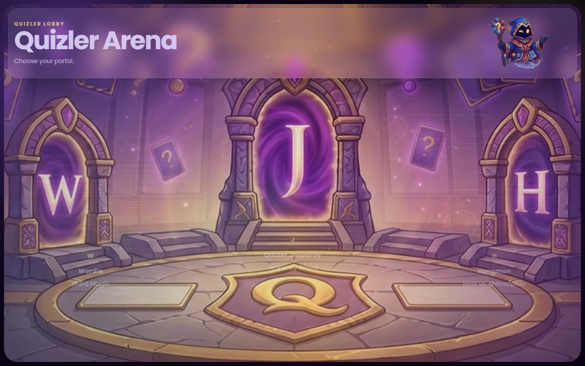
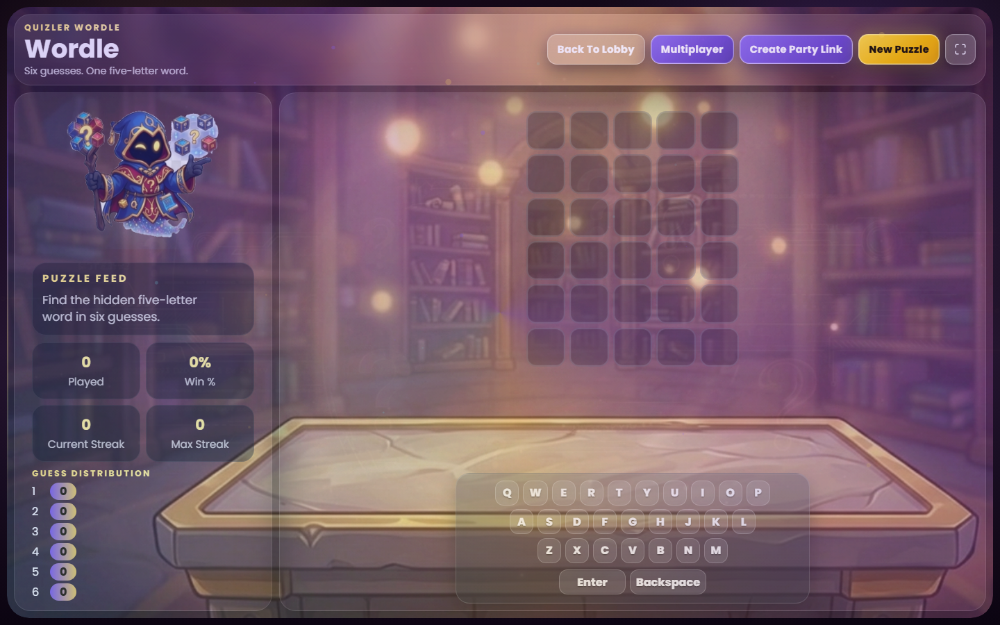
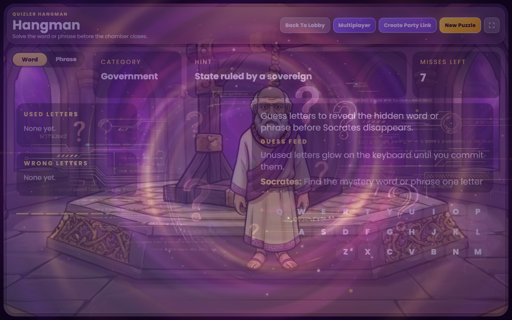
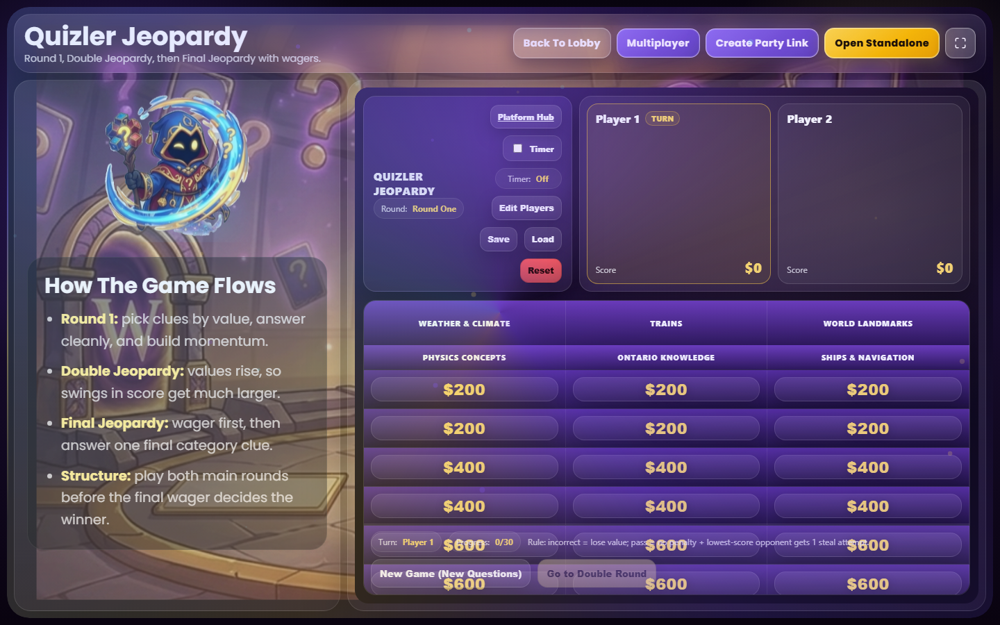
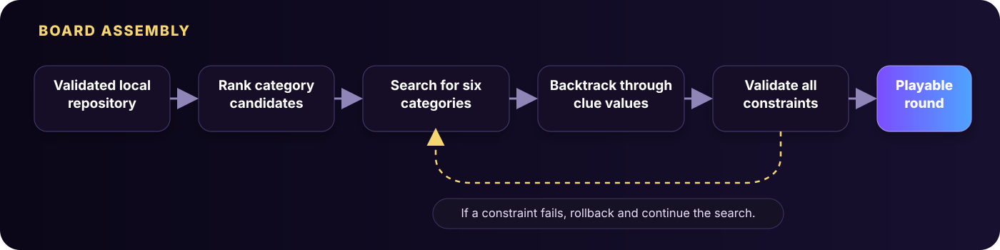
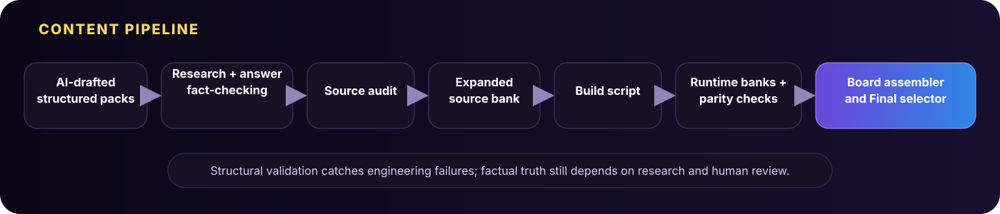
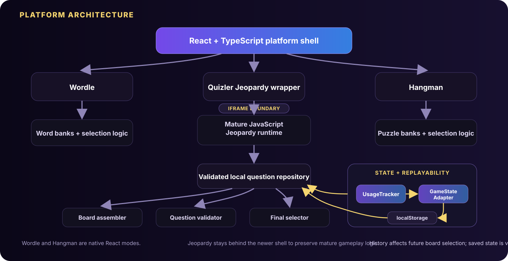
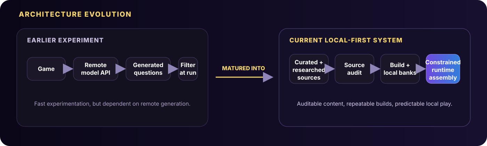

# Quizler Arena

<p align="center">
  <strong>A local-first social game platform built around replayability, content quality, and polished shared-screen play.</strong>
</p>

<p align="center">
  React 18 · TypeScript · JavaScript · Vite · localStorage · Node.js
</p>

<p align="center">
  <a href="https://github.com/kzhu37/QuizArena-Portfolio/actions/workflows/portfolio-verify.yml"></a>
</p>

<p align="center">
  
</p>

<p align="center">
  <sub>The current runtime lobby. The environment, host character, portal hitboxes, hover lighting, particles, and navigation are rendered as separate interactive layers.</sub>
</p>

| 3 playable modes | 5,600 curated expansion clues | 70 curated expansion categories | 200 seeded complete games checked per smoke run |
|---:|---:|---:|---:|
| Wordle, Quizler Jeopardy, Hangman | Added through 14 audited research packs | Structured across Round 1 and Double Jeopardy | Validated across both rounds and Final Jeopardy |

<p align="center">
  <a href="#what-makes-it-technically-interesting">Engineering</a> ·
  <a href="#architecture">Architecture</a> ·
  <a href="#testing-and-reliability">Verification</a> ·
  <a href="#my-role-and-collaboration">My role</a> ·
  <a href="#running-the-project">Run locally</a>
</p>

## Why I built it

Quizler Arena started as a small Jeopardy-style game that I could play with family and friends. I returned to the idea as a larger computer science project in spring 2026, then kept developing it after the original class presentation because repeated play exposed more interesting problems than the first prototype had solved.

The project gradually changed from one board game into a three-mode platform. The important engineering questions also changed. Instead of asking only how to add another feature, I had to think about how to keep content fresh, prevent weak or repetitive boards, recover from bad saved state, make visual assets dependable, support projector and fullscreen play, and keep the project usable without a remote service.

That evolution is the core of the project: **a simple social game became a systems problem about replayability, data quality, state, reliability, and interaction design.**

## The current platform

<table>
  <tr>
    <td width="50%">
      
    </td>
    <td width="50%">
      
    </td>
  </tr>
  <tr>
    <td align="center"><sub>Wordle: native React mode with physical and on-screen keyboard input, persistent statistics, and novelty-aware answer selection.</sub></td>
    <td align="center"><sub>Hangman: native React mode with staged visual progression, hints, dialogue, keyboard input, and weighted puzzle selection.</sub></td>
  </tr>
</table>

<p align="center">
  
</p>

<p align="center">
  <sub>Quizler Jeopardy is the flagship 1 to 4 player mode, with two rounds, Final Jeopardy, Daily Doubles, wagering, custom categories, timers, score tracking, saving, and replayability history.</sub>
</p>

The portfolio screenshots above are captured from the current file-safe build in CI rather than being manually composited mockups.

### Three modes, three selection problems

| Mode | Gameplay | Replayability strategy |
|---|---|---|
| **Wordle** | Five-letter word game with streaks, statistics, duplicate-letter handling, and keyboard input | Avoids recent answers, groups words by difficulty, and penalizes recent letter similarity, prefixes, and suffixes |
| **Quizler Jeopardy** | 1 to 4 player clue-board game with two rounds, Final Jeopardy, Daily Doubles, wagering, custom categories, timers, saving, and score tracking | Searches for valid boards while tracking clue, answer, fingerprint, category, family, and whole-board history |
| **Hangman** | Word and phrase modes with hints, staged progression, dialogue, keyboard input, and win effects | Weights difficulty, recent answers, category repetition, answer similarity, and phrase structure |

## What makes it technically interesting

### 1. Constrained Jeopardy board assembly

A replayable Jeopardy board needs more than random clue selection. A complete game has to satisfy many constraints at once:

- six distinct categories per round
- five playable value slots per category
- strictly increasing clue difficulty within each category
- no repeated clue IDs
- no repeated normalized answers
- no repeated clue fingerprints
- subject-family diversity
- fresh category titles and board patterns
- valid Final Jeopardy options that do not duplicate the main board

The [`boardAssembler`](src/jeopardy/boardAssembler.js) scores clue candidates for freshness and target difficulty, scores categories for recency and subject-family diversity, and uses recursive search with rollback when a partial category cannot be completed.

<p align="center">
  
</p>

The important idea is simple: **freshness is treated as a constrained search problem, not as random sampling.**

### 2. A trivia bank built as a data pipeline

The Jeopardy content system became one of the largest parts of the project. The current curated expansion is split into **14 research packs with 400 rows each**, producing **5,600 additional clues across 70 categories**.

The [`authored-source audit`](tools/audit-jeopardy-authored-sources.cjs) checks source packs before they can enter the runtime bank. It validates properties including:

- required row counts and category/value coverage
- Round 1 and Double Jeopardy value bands
- difficulty ranges
- Jeopardy-style response formatting
- duplicate normalized answers
- duplicate clue text
- malformed text and invalid identifiers
- answers accidentally revealed inside clues
- conflicts with protected historical answers
- repeated source content

<p align="center">
  
</p>

Generated runtime banks are treated as build products rather than hand-edited source files. That separation made large content expansions easier to audit, reproduce, and maintain.

### 3. Replayability uses memory, not just randomness

Each mode remembers enough recent history to reduce obvious repetition without making selection deterministic.

Quizler Jeopardy tracks used clue IDs, normalized answers, clue fingerprints, source category IDs, category titles, subject families, whole-board hashes, title hashes, and family patterns. Wordle and Hangman use smaller history windows and weighted novelty penalties appropriate to their own content.

This became one of the main lessons of the project: **random is not the same as varied.**

### 4. Defensive state and save recovery

The Jeopardy runtime stores game state and usage history in browser `localStorage`, but loaded state is validated before it is trusted.

The [`gameStateAdapter`](src/jeopardy/gameStateAdapter.js) can regenerate a valid game when the current save is malformed. It also includes a legacy-salvage path that preserves usable player information while rebuilding a valid current state.

That changed saving from a convenience feature into a data-integrity problem: persistent state is external input and needs validation too.

### 5. Wordle duplicate-letter correctness

The [`WordleModeScreen`](src/platform/WordleModeScreen.tsx) evaluates repeated letters with a two-pass strategy. Correct-position letters consume matching answer copies first, then present-position letters are checked only against the remaining unmatched copies.

That avoids a common clone bug where repeated letters receive too many yellow matches.

### 6. Asset reliability became an engineering problem

The visual system went through several iterations as filenames, replacement artwork, and staged Hangman images changed. The current platform centralizes visual paths in [`assets.ts`](src/platform/assets.ts), renders them through a shared [`AssetLayer`](src/platform/AssetLayer.tsx), and uses availability checks that do not permanently cache failed lookups.

The goal was not merely nicer art. It was to make asset replacement, fallback behavior, and staged visual state predictable enough that the interface would not break as presentation assets changed.

## Architecture

Quizler Arena uses a hybrid architecture. Wordle and Hangman are native React and TypeScript modes. The newer React platform shell hosts the mature JavaScript Jeopardy runtime inside an iframe instead of forcing an immediate rewrite of a working subsystem.

That decision improved routing, navigation, loading, fullscreen behavior, and visual consistency while preserving the deeper Jeopardy gameplay and board-generation logic.

<p align="center">
  
</p>

Relevant entry points:

- [`src/platform/App.tsx`](src/platform/App.tsx), React routing and shell
- [`src/platform/HubScreen.tsx`](src/platform/HubScreen.tsx), interactive three-portal lobby
- [`src/platform/WordleModeScreen.tsx`](src/platform/WordleModeScreen.tsx), Wordle gameplay
- [`src/platform/HangmanModeScreen.tsx`](src/platform/HangmanModeScreen.tsx), Hangman gameplay
- [`src/platform/JeopardyModeScreen.tsx`](src/platform/JeopardyModeScreen.tsx), React wrapper around the Jeopardy runtime
- [`src/jeopardy/app.js`](src/jeopardy/app.js), Jeopardy gameplay runtime
- [`src/jeopardy/boardAssembler.js`](src/jeopardy/boardAssembler.js), constrained board search
- [`src/jeopardy/questionValidator.js`](src/jeopardy/questionValidator.js), runtime and repository invariants

## A major design decision: from live generation to local-first content

An early version of Quizler Jeopardy experimented with generating questions at runtime through a hosted language-model API. It was useful for exploring large amounts of content quickly, but repeated use made the tradeoffs increasingly obvious.

The current runtime deliberately uses a local question source, and remote generation is disabled in [`questionSourceAdapter.js`](src/jeopardy/questionSourceAdapter.js).

<p align="center">
  
</p>

The local-first architecture improved:

- startup without a remote API dependency
- inspectability before gameplay
- repeatable builds
- duplicate and difficulty controls
- automated testing
- credential safety
- local board-construction speed

This became an important engineering judgment call. A newer technology had been useful for experimentation, but reliability and control became more valuable than keeping it in the final runtime.

## Testing and reliability

The project has separate tooling for content validation, runtime smoke testing, static-file compatibility, and full-platform verification.

### Integrated verification

`npm run verify` coordinates a multi-stage pipeline:

1. audit the curated Jeopardy source packs
2. rebuild the Jeopardy bank
3. run the Jeopardy runtime smoke harness
4. synchronize the legacy runtime into the platform
5. audit generated-bank content and parity
6. build the Vite platform shell
7. build the direct-file shell
8. smoke-test the lobby and all three routes

The GitHub Actions workflow runs this verification on Windows and then captures the portfolio screenshots from the verified build.

### 200 seeded complete games per smoke run

The [`Jeopardy runtime smoke harness`](tools/jeopardy-runtime-smoke.html) constructs **200 deterministic complete game packages**, alternating difficulty modes and 1 to 4 player counts. For every package it validates both rounds and Final Jeopardy.

It checks that games do not repeat category titles, clue IDs, normalized answers, or clue fingerprints, and that difficulty increases within each category. The same harness also exercises:

- custom category mode
- two custom rounds
- Final Jeopardy selection
- even custom-category draft distribution
- fresh save/load behavior
- corrupted current-save recovery
- legacy-save salvage

The repository also includes a direct-file smoke test for the lobby and all three routes after the static shell is built.

## Feedback and iteration

The project was not developed from a fixed specification. Repeated play, presentation testing, technical failures, and feedback changed what I prioritized.

| Feedback or observed problem | What changed |
|---|---|
| One game did not provide enough variety for repeated group play | The project became a focused three-mode platform: Wordle, Quizler Jeopardy, and Hangman |
| Weaker hardware and projector use made presentation quality part of usability | Fullscreen behavior, no-scroll layouts, larger controls, readability, and local execution received more attention |
| Repeated games exposed content repetition and weak clue combinations | The Jeopardy bank grew substantially, usage history was added, and board construction became constraint-based |
| Changing visual assets caused stale paths, fallback issues, and incorrect Hangman stages | Asset paths were centralized and staged visuals were moved behind a shared reliability layer |
| A working feature was not always a dependable feature | Saving, local data, validation, build reproducibility, and smoke testing became first-class parts of the project |

The most important outcome was not a single feature. It was the shift from thinking about what the game could do once to thinking about whether it would still work well after repeated use.

## My role and collaboration

**I designed and developed Quizler Arena**, from the original Jeopardy prototype through the current three-mode platform. My development work includes:

- product direction and the three-mode platform structure
- the React/Vite shell, routing, lobby, and mode integration
- Jeopardy gameplay architecture and continued iteration
- constrained board assembly and replayability logic
- local content repositories, validation, and bank-building workflows
- Wordle and Hangman gameplay and selection behavior
- persistence, save recovery, fullscreen behavior, loading flow, and interaction polish
- build, audit, smoke-test, and screenshot-capture tooling
- feedback-driven refinement after the original class deadline

[Vladimir Duckardt](https://github.com/VDuckardtt) provided **limited debugging help on visual implementation issues**, particularly Hangman asset replacement and the stage-image layering and transition behavior. Those contributions are credited here and are not presented as my work.

AI-assisted development tools were used during parts of implementation, debugging, content drafting, and visual experimentation. I treated generated output as implementation material to inspect, test, revise, or replace. One of the project's largest later changes was specifically moving away from runtime generation toward curated local data and reproducible validation.

## Development timeline

| Stage | What changed |
|---|---|
| **Initial prototype** | Built a small Jeopardy-style game for social play with family and friends |
| **April 2026: larger project** | Expanded the original game, experimented with live question generation, and developed a stronger presentation and visual identity |
| **April 2026: platform expansion** | Added the React/Vite shell, focused the product on Wordle, Quizler Jeopardy, and Hangman, and improved portal navigation, fullscreen use, assets, and presentation |
| **May 2026: gameplay and content refinement** | Improved category handling, clue quality, timers, custom categories, difficulty behavior, and duplicate prevention |
| **August 2026: reliability and scale** | Added the 5,600-clue curated expansion, strengthened audits and normalization, removed weak generated trivia sources, reinforced the local-first runtime, and curated the project as a public technical portfolio |

## Technology

| Area | Tools |
|---|---|
| Frontend | React 18, TypeScript, JavaScript, HTML, CSS |
| Routing | React Router |
| Build | Vite, esbuild, npm |
| Data and tooling | Node.js, PowerShell, JSON, TSV |
| Persistence | Browser localStorage |
| Validation and testing | Custom Node validators, browser smoke harnesses, static route smoke tests, GitHub Actions |
| Version control | Git, GitHub |

The hybrid React and JavaScript structure is intentional. It reflects incremental migration around a mature subsystem rather than a rewrite for its own sake.

## Running the project

### Requirements

- Node.js and npm
- Windows PowerShell for the current build scripts
- Microsoft Edge for the direct-file smoke test and portfolio capture tooling

### Development

```bash
npm install
npm run dev
```

The development command rebuilds the Jeopardy bank, synchronizes the legacy runtime, and starts Vite.

### Production build

```bash
npm run build
```

### Full verification

```bash
npm run verify
```

Useful focused commands:

```bash
npm run bank:audit:sources
npm run bank:audit
npm run wordgames:validate
npm run smoke:legacy
npm run smoke:platform:file
```

## Project structure

```text
QuizArena-Portfolio/
├── data/
│   ├── jeopardy-bank/        # Curated source data, research packs, tracking, build inputs
│   └── word-lists/           # Source word lists used by word-game tooling
├── docs/
│   ├── diagrams/             # Architecture and engineering diagrams
│   └── media/                # Reproducible portfolio screenshots
├── public/
│   └── assets/               # Runtime visual assets
├── src/
│   ├── platform/             # React shell, Wordle, Hangman, shared UI, asset system
│   └── jeopardy/             # Jeopardy repository, validation, assembly, state, gameplay
├── tools/                    # Build, audit, validation, smoke-test, capture scripts
├── index.html
├── package.json
└── vite.config.ts
```

Generated Jeopardy runtime banks and synchronized legacy output are treated as build products and rebuilt from committed sources.

## Current scope and boundaries

Quizler Arena is currently a **local-first** platform with three playable modes.

The React shell also contains presentation-only multiplayer concepts and party-link UI. Those controls demonstrate how remote play could be presented, but they do not create hosted online rooms or a live matchmaking service.

The build workflow remains Windows-oriented because the bank and synchronization scripts use PowerShell. Cross-platform orchestration and hosted multiplayer are possible future engineering directions, not completed features.

## What I learned

**Reliability can matter more than novelty.** Live generation was interesting to explore, but a tested local content pipeline became a better fit for the product.

**Random is not the same as varied.** Replayable games need memory, constraints, weighting, and deliberate diversity.

**Persistent data should be treated as untrusted input.** Save recovery became more robust once I stopped assuming stored state was valid.

**Finishing the assignment was not the end of the engineering.** Many of the strongest systems in the project, including the larger content pipeline, board-selection logic, save recovery, and validation tooling, came from continuing to improve the project after its original presentation.

## Attribution and project notes

Quizler Arena includes third-party software packages and word-list sources. See [`THIRD_PARTY_NOTICES.md`](THIRD_PARTY_NOTICES.md) for source and reuse notes.

Quizler Jeopardy is an unofficial student project inspired by the familiar Jeopardy-style clue-board format. It is not affiliated with or endorsed by the television program or its rights holders.

---

### Selected technical files

- [`src/jeopardy/boardAssembler.js`](src/jeopardy/boardAssembler.js), constrained board search and freshness scoring
- [`src/jeopardy/questionValidator.js`](src/jeopardy/questionValidator.js), runtime and repository invariants
- [`src/jeopardy/usageTracker.js`](src/jeopardy/usageTracker.js), persistent replayability history
- [`src/jeopardy/gameStateAdapter.js`](src/jeopardy/gameStateAdapter.js), save validation and recovery
- [`tools/audit-jeopardy-authored-sources.cjs`](tools/audit-jeopardy-authored-sources.cjs), source-pack quality checks
- [`tools/jeopardy-runtime-smoke.html`](tools/jeopardy-runtime-smoke.html), seeded complete-game smoke testing
- [`src/platform/wordleData.ts`](src/platform/wordleData.ts), Wordle difficulty and novelty selection
- [`src/platform/hangmanData.ts`](src/platform/hangmanData.ts), Hangman puzzle weighting and history
- [`src/platform/HubScreen.tsx`](src/platform/HubScreen.tsx), interactive three-portal lobby
- [`tools/capture-portfolio.ps1`](tools/capture-portfolio.ps1), reproducible portfolio screenshot capture
