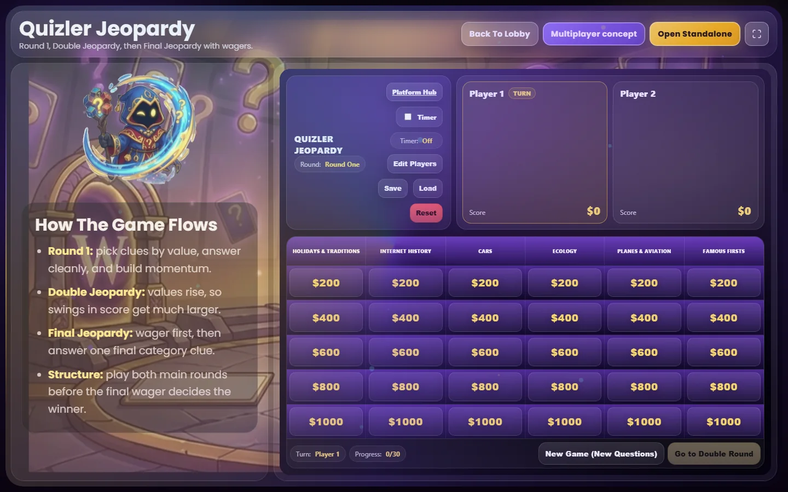
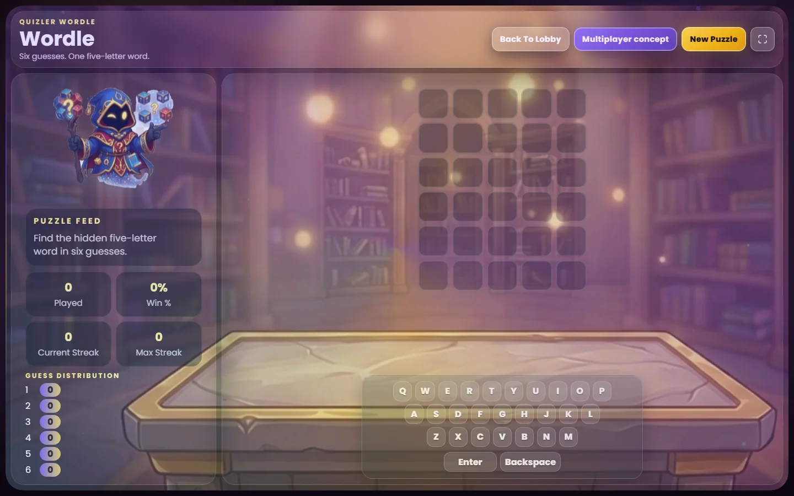
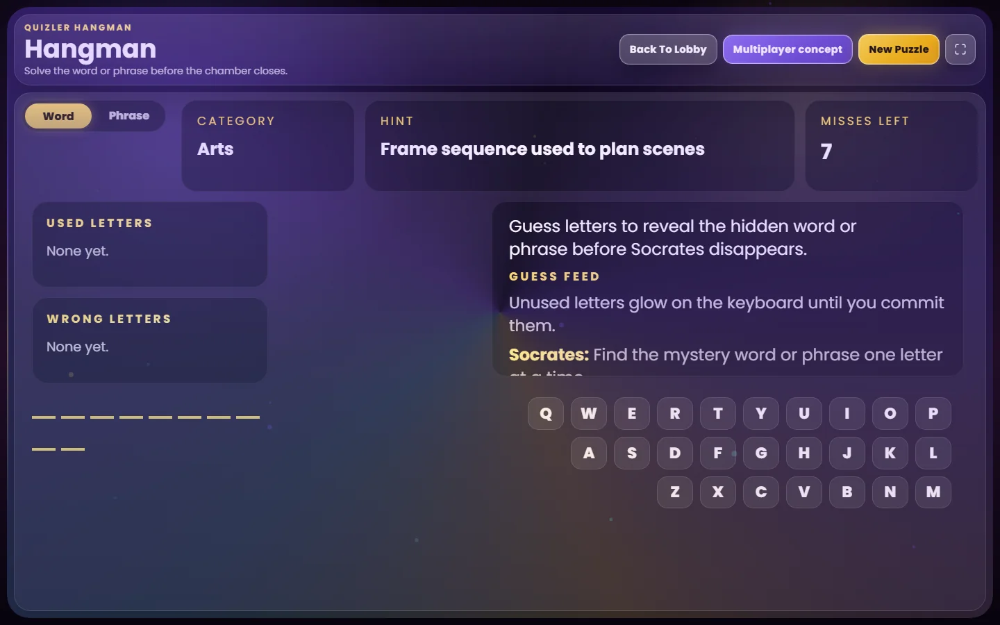

# Quizler Arena

<p align="center">
  <strong>A local-first social game platform built from a family Jeopardy prototype. Its flagship mode turns repeated play into a constrained search problem: generate fresh, valid boards while preserving difficulty, topic balance, replayability, and recoverable state.</strong>
</p>

<p align="center">
  React 18 · TypeScript · JavaScript · Vite · Node.js · localStorage
</p>

<p align="center">
  <a href="https://quizler-arena-portfolio.vercel.app"><strong>Live Demo</strong></a>
  &nbsp;·&nbsp;
  <a href="src/jeopardy/boardAssembler.js"><strong>Inspect Board Assembler</strong></a>
  &nbsp;·&nbsp;
  <a href="tools/jeopardy-runtime-smoke.html"><strong>Verification Harness</strong></a>
</p>

<p align="center">
  <a href="https://github.com/kzhu37/QuizArena-Portfolio/actions/workflows/portfolio-verify.yml"></a>
</p>

<table>
  <tr>
    <td width="54%">
      
    </td>
    <td width="46%">
      
    </td>
  </tr>
  <tr>
    <td align="center"><sub><strong>Playable system:</strong> complete boards for repeated shared-screen play.</sub></td>
    <td align="center"><sub><strong>Engineering center:</strong> scoring, coupled constraints, recursive search, and rollback replace simple random sampling.</sub></td>
  </tr>
</table>

<p align="center">
  <a href="#at-a-glance">Overview</a> ·
  <a href="#engineering-center-constrained-board-generation">Engineering</a> ·
  <a href="#replayability-state-integrity-and-recovery">State</a> ·
  <a href="#from-family-game-to-repeatable-system">Iteration</a> ·
  <a href="#architecture-and-tradeoffs">Architecture</a> ·
  <a href="#verification-and-ci">Verification</a> ·
  <a href="#three-playable-modes">Modes</a> ·
  <a href="#content-pipeline-and-verified-scale">Content</a> ·
  <a href="#contribution-and-collaboration">Contribution</a>
</p>

## At a glance

| Area | Quizler Arena |
| --- | --- |
| **Product** | Three playable local-first modes: Quizler Jeopardy, Wordle, and Hangman |
| **Origin** | Began as a Christmas family and friends Jeopardy-style prototype, then became a larger platform project in April 2026 |
| **Real use** | Repeated social play plus multiple full-class shared-screen sessions exposed replayability, pacing, projector, screen-fit, and performance problems |
| **Technical centerpiece** | Recursive Jeopardy board assembly with candidate scoring, clue-level backtracking, and category-level rollback |
| **Current Jeopardy bank** | 8,319 regular clues plus 262 Final Jeopardy clues in the validated local runtime |
| **Replayability** | History-aware clue, answer, category, topic-family, and full-board novelty tracking |
| **Verification** | 200 deterministic complete game packages per smoke run, plus rollback tests, source audits, type checking, builds, routes, persistence, and recovery |
| **My role** | Sole designer and developer from the original social prototype through the current three-mode platform |

**Core implementation:** [`boardAssembler.js`](src/jeopardy/boardAssembler.js) · [`gameStateAdapter.js`](src/jeopardy/gameStateAdapter.js) · [`usageTracker.js`](src/jeopardy/usageTracker.js) · [`questionSourceAdapter.js`](src/jeopardy/questionSourceAdapter.js)

**Executable proof:** [`forced rollback and usage-history tests`](tools/test-board-assembler.cjs) · [`200-game deterministic smoke harness`](tools/jeopardy-runtime-smoke.html)

## Engineering center: constrained board generation

Repeated play exposed a problem that random selection could not solve. Category freshness, topic balance, clue value, increasing difficulty, answer uniqueness, clue uniqueness, recent history, and full-board novelty all interact.

A standard round must satisfy:

- six distinct categories with bounded topic-family concentration;
- five values per category with strictly increasing clue difficulty;
- no repeated clue IDs, normalized answers, or clue fingerprints;
- reduced repetition across recent titles and topic families;
- fresh board, title-set, and family-pattern combinations.

[`boardAssembler.js`](src/jeopardy/boardAssembler.js) uses two nested searches. Each category candidate first needs a legal five-value clue path. Clue IDs, normalized answers, and fingerprints are reserved as the search advances, then unwound if a later value becomes impossible. Once a category is committed, the assembler recursively searches for the next one. If a later category blocks completion, the earlier category and its reserved clues are rolled back.

A concrete failure case is simple: an early category can reserve an answer that a later category needs as its only valid option. The assembler must release the earlier category and its clues, then continue down a different branch.

The search is bounded rather than exhaustive: each category step considers at most 30 ranked candidates, with up to 36 round attempts and 48 complete-game attempts. A synthetic test forces a downstream answer conflict and verifies category rollback; another confirms that prior usage history changes future selection.

**Freshness became a constrained search problem, not a random-sampling problem.**

## Replayability, state integrity, and recovery

[`usageTracker.js`](src/jeopardy/usageTracker.js) records used clues, normalized answers, source categories, titles, topic families, and recent board, title-set, and family-pattern hashes. That history influences future selection instead of resetting each game to pure randomness.

[`gameStateAdapter.js`](src/jeopardy/gameStateAdapter.js) treats browser persistence as untrusted input. It validates runtime version, players, both standard rounds, board integrity, and Final Jeopardy data before resuming. Invalid current state is removed and regenerated, with limited continuity such as player names preserved where possible. Older saves can also be salvaged into the current runtime.

<p align="center">
  
</p>

## From family game to repeatable system

Quizler Arena began as a Christmas Jeopardy-style game for family and friends, partly inspired by how much my dad enjoys Jeopardy. Returning to it as a larger project in April 2026 exposed problems that one successful demo could hide.

| What repeated use exposed | Engineering response |
| --- | --- |
| Duplicate answers, repetitive categories, and weak clue combinations across games | Persisted history, novelty scoring, topic-family balancing, deduplication, and constrained assembly |
| Projectors and different display sizes could push gameplay-critical UI outside the useful viewport | Fullscreen controls, no-scroll layouts, responsive board sizing, larger priority text, and cross-screen stability work |
| On weaker graphics hardware, decorative complexity could become a reliability problem | Reduced visual load, refined layering and fallbacks, and centralized asset mapping |
| Runtime-generated questions could vary in quality and depend on a hosted service | Checked local data with source auditing, reproducible bank generation, and runtime parity checks |
| Saved JSON could still violate game invariants | State validation, corrupted-save regeneration, and legacy continuity salvage |
| One valid board did not prove future combinations would work | 200 deterministic complete-game packages per smoke run plus focused rollback tests |

Full-class shared-screen sessions made pacing, projector readability, and screen fit practical constraints, while social play exposed repetition over time. **Michael Tetelbaum** encouraged the move from one Jeopardy game toward a broader Arena. **Vladimir Duckardt** raised performance and visual concerns, including behavior on weaker hardware.

See [`docs/ITERATION.md`](docs/ITERATION.md) for the observation record and [`docs/DEVELOPMENT_HISTORY.md`](docs/DEVELOPMENT_HISTORY.md) for the dated sequence.

## Architecture and tradeoffs

Wordle and Hangman are native React and TypeScript modes. The newer shell hosts the mature JavaScript Jeopardy runtime inside an iframe rather than forcing a late rewrite of a working subsystem.

That preserved the deeper gameplay, board assembly, replayability, and persistence logic while adding a unified shell. The tradeoff is a less direct shared boundary than a full typed migration.

An early April version also experimented with hosted runtime question generation. Network dependence, inconsistent output, credential handling, and weaker reproducibility pushed the final runtime toward checked local sources. Remote generation is disabled in [`questionSourceAdapter.js`](src/jeopardy/questionSourceAdapter.js). See the [`architecture evolution diagram`](docs/diagrams/local-first-evolution.svg).

Hosted multiplayer rooms, matchmaking, rankings, and remote synchronization remain outside the implemented scope.

## Verification and CI

[`tools/jeopardy-runtime-smoke.html`](tools/jeopardy-runtime-smoke.html) constructs **200 deterministic complete game packages** per smoke run. It validates both rounds and Final Jeopardy, package-wide uniqueness, and difficulty progression, then exercises custom categories, save/load, corrupted-save recovery, and legacy continuity salvage.

Focused Node tests cover normalization, difficulty paths, forced rollback, and usage-history influence. The [GitHub Actions workflow](.github/workflows/portfolio-verify.yml) adds dependency auditing, punctuation lint, strict TypeScript checks, source audits, Wordle and Hangman validation, builds, generated/runtime parity, and Linux/Windows route checks. A manual capture job reproduces the README screenshots from a production build.

### Current limitations

- Automated content audits cannot determine whether every trivia fact is correct.
- Family, social, and full-class use were not instrumented with production analytics, so I do not claim retention, performance improvement, or a verified distinct-player count.
- Preserving the mature Jeopardy runtime avoids rewrite risk, but leaves a less direct platform boundary than a complete typed migration.

## Three playable modes

<p align="center">
  
</p>

### Quizler Jeopardy

Supports 1 to 4 players, Round One, Double Jeopardy, Final Jeopardy, Daily Doubles, wagering, scoring, pass and steal flow, custom categories, timers, persistence, and history-aware replayability.

### Wordle and Hangman

<table>
  <tr>
    <td width="50%">
      
    </td>
    <td width="50%">
      
    </td>
  </tr>
  <tr>
    <td align="center"><sub><strong>Wordle:</strong> keyboard input, persistent statistics, novelty-aware answer selection, and two-pass duplicate-letter evaluation.</sub></td>
    <td align="center"><sub><strong>Hangman:</strong> word and phrase modes, hints, staged visuals, dialogue, keyboard input, and weighted puzzle selection.</sub></td>
  </tr>
</table>

These modes broaden the product, while Quizler Jeopardy remains the deepest algorithms, data, state, and testing story.

## Content pipeline and verified scale

The validated runtime contains **8,319 regular clues and 262 Final Jeopardy clues**. A major August expansion added **5,600 source rows across 14 structured packs**.

I defined the source format and constraints, used AI-assisted structured drafting for the initial records, then researched and fact-checked answers, corrected weak material, integrated the reviewed packs, and built the duplicate controls, source audits, bank generation, and runtime parity checks around them. I do not present the 5,600 rows as individually hand-written from scratch.

<p align="center">
  
</p>

Automation checks structure, coverage, difficulty bands, normalized duplicates, clue fingerprints, answer leakage, source freshness, and generated/runtime parity. It does not prove factual truth, so research and human review remain separate. See [`data/CONTENT_METHODOLOGY.md`](data/CONTENT_METHODOLOGY.md).

## Run locally

Requires Node.js 20 or newer and npm.

```bash
npm ci
npm run dev
```

<details>
<summary><strong>Verification and repository map</strong></summary>

```bash
npm test
npm run verify:portable
```

The deeper Windows verification and reproducible screenshot capture require Windows PowerShell and Microsoft Edge:

```bash
npm run verify
```

- [`src/platform/`](src/platform): React shell, Wordle, Hangman, shared UI, fullscreen behavior, assets, and routing
- [`src/jeopardy/`](src/jeopardy): Jeopardy repository, validation, board assembly, usage history, persistence, and gameplay
- [`data/`](data): reviewed source inputs, word-list inputs, provenance notes, and content methodology
- [`tools/`](tools): build, audit, test, smoke, synchronization, and capture tooling
- [`docs/`](docs): diagrams, product captures, iteration notes, development history, and asset provenance

Generated Jeopardy banks and synchronized public runtime output are ignored by Git and rebuilt from committed inputs. See [`data/README.md`](data/README.md).

</details>

## Contribution and collaboration

I designed and developed Quizler Arena from the original social Jeopardy prototype through the current platform. My work includes the three-mode product structure, React/Vite shell, Jeopardy gameplay and constrained assembly, replayability and recovery, local content pipelines, Wordle and Hangman, and the build, test, CI, and capture tooling that verifies the project.

**Michael Tetelbaum** provided early product feedback that encouraged the broader Arena. **Vladimir Duckardt** provided performance and visual feedback and later limited debugging help on Hangman asset replacement, staged-image layering, and transition behavior. Those contributions are credited separately from my implementation work.

## Attribution and reuse

Third-party software, word-list sources, collaboration notes, AI-assisted content drafting, visual-asset provenance, and reuse details are documented in [`THIRD_PARTY_NOTICES.md`](THIRD_PARTY_NOTICES.md) and [`docs/ASSET_PROVENANCE.md`](docs/ASSET_PROVENANCE.md).

Quizler Jeopardy is an unofficial independent project inspired by the familiar Jeopardy-style clue-board format. It is not affiliated with or endorsed by the television program or its rights holders.
